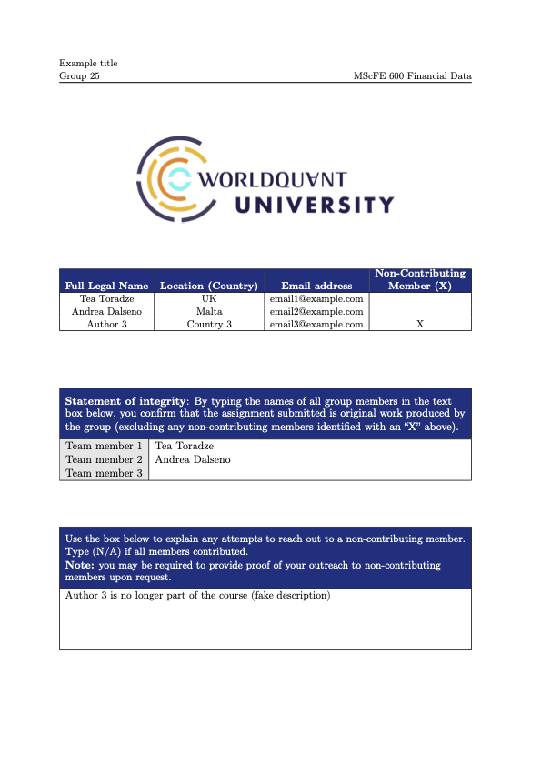

# How to use this template
[Download the file](./examples/frontpage/front_page_gwp.zip), unzip it and compile it using your local LaTeX editor or, recommended, upload the zipped file and open it using [Overleaf](https://www.overleaf.com?r=049a7499&rm=d&rs=b).

Fill the variables with the required information (e.g.):
% Insert the required information 
\def\gwpmodule{MScFE 600 Financial Data} %Module Number and Name 
\def\gwptitle{Example title} % work title 
\def\gwpgroup{Group 25} % group number 
 

% Define authors 
\def\authone{Tea Toradze}% Insert Name and Surname 
\def\authtwo{Andrea Dalseno} 
\def\auththree{Author 3} 
 
% Define country 
\def\countryone{UK} 
\def\countrytwo{Malta} 
\def\countrythree{Country 3} 
 
% Define email 
\def\emailone{email1@example.com} 
\def\emailtwo{email2@example.com} 
\def\emailthree{email3@example.com} 
 
% Define non contributing members 
\newcounter{contone} % Do not modify this 
\newcounter{conttwo} % Do not modify this 
\newcounter{contthree} % Do not modify this 
 
\setcounter{contone}{1} % set to 0 for non contributing member -> \setcounter{contone}{0} 
\setcounter{conttwo}{1} 
\setcounter{contthree}{0} 

Will produce the following front page: 

The high resolution PDF is available [here](./examples/frontpage/frontpage_gwp_MScFE_600.pdf)
